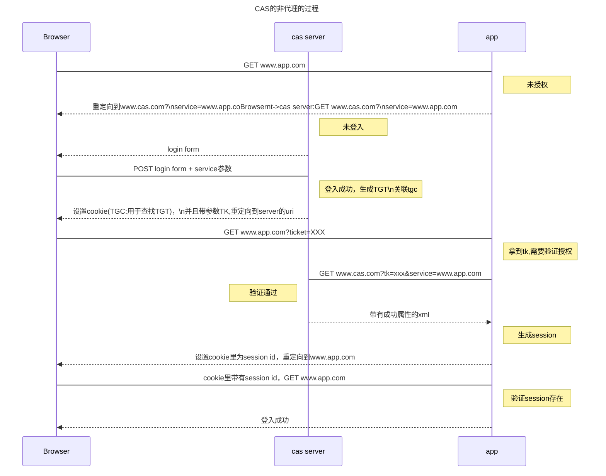
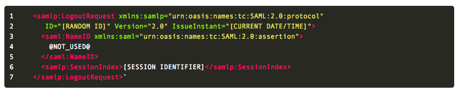
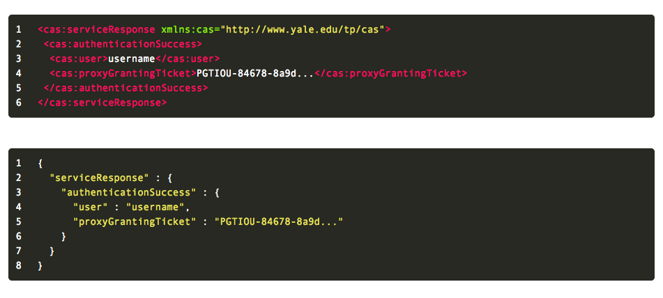
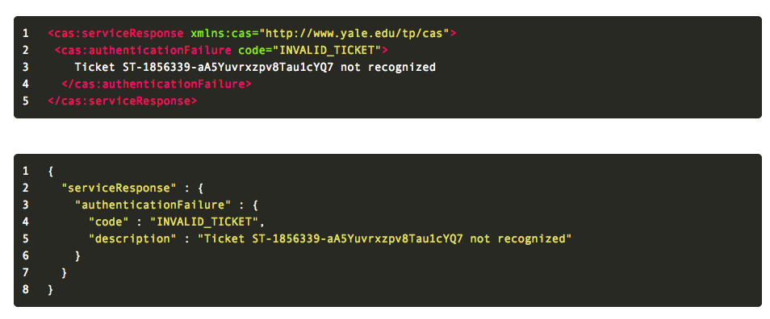

###[CAS]
>- **TGT**: 一种情况是tgt是一个对象，类似session，是验证成功之后创建的。存着一些信息，这种情况下tgc值就是tgt对象的id。另一种情况是tgt是一个字符串，那么tgc的值就是tgt，tgt还是需要关联session存储一些信息。
>- **TGC**: cookie，基本存储的就是tgt或者tgt的id。
>- **TK** : 从cas sever中获取, (cas实现是)根据tgt和service随机生成。

**第二次登入该app：** 由于浏览器中还存在该cookie（TGC），再次访问app时，app根据cookie中的信息找到对应的TGT直接登入成功。
**访问其他未访问过的 appB:** 由于浏览器没有存储过appB的cookie，所以链接的时候,appB会认为该链接未授权，并且重定向到cas服务器,浏览器的cookie中存在cas的tgc信息，cas检测到之后，找到对应的TGT，并且重定向到appB并且带参数tk。appB检测到tk之后向cas请求验证，之后和上面的流程图一样。

----------
#### cas协议摘要:
###/login接口
`一、作为凭证请求者：`如果客户端已经和cas server已经建立过session，那么会有一个tgc(ticket granting cookie),其包含了一个key(即tgt对象的id),如果它对到一个合法的tgt，那么cas server会给客户端签发一个st(service ticket)。
**参数**:  在/login作为请求者的时候,会有以下参数，并且大小写敏感。
>1. service(可选): 客户端希望请求的地址，这个url必须被URL-encode过
>2. renew(可选): 如果该参数存在，跳过单点登入，要求客户端必须重新验证。
>3. gatewat(可选): 不可以与renew一起使用，设置之后不要求客户端验证
>4. method(可选,CAS 3.0): 回复的时候使用，通常用GET，如果需要用POST可以设置，需要CAS支持。

**用户名/密码过程的回复**:通常情况下，cas会显示一个登入页面。这个页面必须包含“username”, “password”,和 “lt”. "warn" 也可以包含，如果service指定了，service也必须是表示的参数。 

**验证中心的回复**:如果/login请求凭证是有效的，那么会透明的跳转到客户端希望前往的页面。或者提示客户端是和否跳转。如果验证失效，需要返回原因。

**sso的回复**:如果已经和cas建立过链接，客户端会提供tgc, 那么会像下面章节的操作。如果renew参数被设置的话，会重新走sso流程。

`二、作为验证者:`当 /login接口接收到一系列验证的参数，就会作为一个凭证验证者。
**参数**：
>1. service参数:同上面/login作为请求者。
>2. warn: 如何warn被设置，那么不能透明的跳转，必须提示
>3. method: 同上

**用户/密码过程的回复**:
>1. username(必须)
>2. password(必须)
>3. lt(可选):login ticket详细内容不讨论。
>4. rememberMe(可选,cas 3.0):如果设置了需要创建一个长期有效的tgt，需要看cas server是和支持。

**验证中心**: 没有参数要求。

**最终回复**:下面的回复必须有一个被返回。
>- 当登入成功的时候: 重定向到客户端请求的service并且必须包含一个'ticket'参数,如果service没有指定,那么需要提示客户端已经登入成功。
>- 如果登入失败，回到/login并且作为一个登入请求。

--------

###/logout接口
登出操作需要清除cas session（即tgt），还有tgc。后续login请求都应该被拒绝，直到客户端下次登入。

**参数**: service(可选, cas 3.0) 如果service参数被指定，那么登出后，浏览器启动跳转到service指定的url。(2.0中有url参数，3.0中已经失效。)(作用是登出之后显示在页面中，需要用户点击才跳转。个人理解)

**响应**:  /logout必须展示一个页面如果没有指定service。

###Single Logout（SLO）
cas server可以支持单点登出，即不仅要在cas server登出，并且所有登入过的客户端都需要登出。如果cas支持SLO，那么必须发送一个包含了如下图的信息的HTTP POST请求。给所有注册过service的客户端。客户端也可以不支持SLO POST请求，那么会忽视该次登出。SLO 也可以在cas server session过期的时候使用。

**服务端行为**
服务端会忽略所有请求SLO POST客户端登出请求的错误

**客户端行为**
是否处理SLO POST请求取决于客户端。建议通过SLO POST请求中的service ticket清除客户端的session。如果客户端支持请求，那么应该返回一个http状态码

###/validate[cas 1.0]
检查service ticket 是否有效

**参数**:
>1. service(必须)出的标志。客户端的url。
>2. ticket(必须) 登入的时候签发的st。
>3. renew(可选) 如果设置了该参数，仅仅当登入后的第一次验证有效。之后需要重新登入。

**响应**
如果成功
yes\<LF\>
如果失败
no\<LF\>

###/serviceValidate[cas 2.0]
(默认返回xml)检查tk，并且返回一个xml。代理部分不讨论。
**参数**:
>1. service(必须)出的标志。客户端的url。
>2. ticket(必须) 登入的时候签发的st。
>3. pgtual(可选): 不讨论
>4. renew(可选):同上
>5. format(可选):JSON或者XML，默认是XML

**响应**
如图:

###实体介绍（st,tgc,tgt等）
###service ticket(ST)
st是客户端获取cas server登入权限的凭证，是同过上文的/login请求方式，再由cas server签发的。

**st的属性(要求)**
 >1. st仅能提供给(通过/login签发这个st的那个service)service使用
 >2. st仅能验证一次，不论验证成功失败，都必须失效。之后还拿这个st的验证全部失败。
 >3. cas server应该给st设置一个过期时间当被签发后，如果过期的验证失败
 >4. 建议返回描述为什么验证失败
 >5. 检验超时时间一般为5分钟。根据本地安全策略改变
 >6. st必须是一个安全的随机数据，不会被猜到。
 >7. st必须以ST-开头
 >8. 服务端必须支持接受32位字符长度，最好支持到256位
 
###ticket-granting cookie
 tgc是一个http coodie，是cas当链接建立的时候设置的。客户端通过提供一个合法的tgc，可以跳过首次登入的步骤。

**tgc的属性**
>1. 当浏览器的session被销毁的时候，tgc需要被销毁
>2. cas需要限定cookie路径，应该设置为/cas
>3. tgc的值需要在合理的时间内不被猜处理。
>4. tgc的命名应该以TGC-开头
>5. tgc的值应该和tgt的规则一样，典型的一种方式是tgc的值就是tgt.

###ticket-granting ticket
TGT是当/login成功时生成的，TGT和TGC有绑定关系，TGT是用于获取tk的基础。

**TGT的属性**
>1. tgt用于多次获取tk.tgt不是一次性的，但是有失效周期和过期策略。
>2. tgt必须清除，当客户端登出
>3. tgt必须是一串安全的数据，在合理时间内不被暴力破解
>4. 应该以 TGT-开头
>5. 建议tgt应该被加密

-----
>###`个人问题和理解整理:`
>- 登出的时候需要通知所有客户端，那么就需要存储所有客户端的url, 由于客户端和服务端只有一个tgc和一个tgt，而且tgc只是一个cookie。那么url只能存储在tgt中，并且关联st(查看SLO 章节)。登出的时候通过TGT中的ST-url关系调用所有的客户端登出(调用成功失败忽略)。客户端需要缓存st和session的关系，用于后续删除。
>- 由于客户端缓存了st和session的关系，需要注意当session过期时候，监听并且删除session，否则会内存溢出。
>- session超时问题: 1.tgt过期，要么实现监听，一旦tgt过期，就通知所有客户端注销。另外一种方式是不通知，客户端已经登入的还可以使用。2. 客户端的session过期，如果tgt还没有过去，客户端再次请求的时候，又会自动登入上，所以这种情况不做特殊处理。

----------

>- CAS参考资料：
https://apereo.github.io/cas/5.0.x/protocol/CAS-Protocol.html
https://apereo.github.io/cas/5.0.x/protocol/CAS-Protocol-Specification.html
http://www.cnblogs.com/flying607/p/7598248.html		
https://blog.csdn.net/elim168/article/details/43560737

